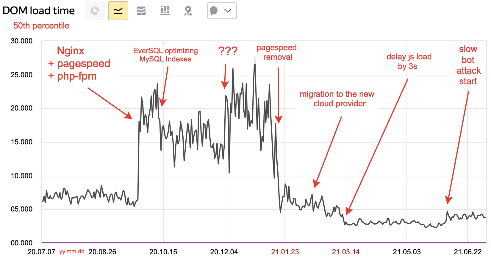
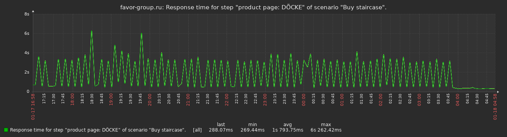

---
tags:
- english
- software
- site-reliability
- architecture
date: 2021-08-27T18:00:00Z
title: A year of SRE work on a small Bitrix site
description: A tale on Site Reliability Engineer looking into tiny business web service performance and reliability
coverart: DOM\_load\_time\_July\_2020\_to\_2021\_50th\_percentile.png
coveralt: "DOM load time from July 2020 to July 2021"
slug: year-of-sre-work-on-bitrix
---

1. [Big problems on a small scale](/2020/small-forms/)

1. A year of SRE work on a small Bitrix site (this post)

In this post, you'll learn what I learned over a year when I picked up responsibility for my father's website commercial and technical success. Despite all my Site Reliability experience, I wasted plenty of time and effort due to not following two simple rules I already knew, which are **don't change the system without looking at the relevant data and graphs** you identified as a target of a change in advance, and, the primary rule of any refactoring, **avoid introducing multiple changes at once** as they make results interpolation close to impossible.

## Site speed

The website has a lot of decent content with SEO-friendly metadata, however, it did not have as good search engines positions as it deserved. One of the solid factors for search positions, especially for mobile users, is [site loading speed](https://developers.google.com/web/updates/2018/07/search-ads-speed). I thought it was the biggest problem I could fix to give the site an edge versus competitors.

I assumed that replacing Apache with Nginx + php-fpm, enabling [Nginx PageSpeed mod](https://github.com/apache/incubator-pagespeed-ng) and upgrading PHP version alongside checking the code for possible JS optimisations should speed the site up. The page readiness time graph below shows that part of the assumptions had the effect precisely opposite to the desired one.

Percentiles: [50th](DOM_load_time_July_2020_to_2021_50th_percentile.png) | [75th](DOM_load_time_July_2020_to_2021_75th_percentile.png) | [90th](DOM_load_time_July_2020_to_2021_90th_percentile.png) | [95th](DOM_load_time_July_2020_to_2021_95th_percentile.png)

<!--more-->

Nginx enablement at the end of **September** 2020 showed no significant speed change over Apache in the [Chrome Lighthouse](https://developers.google.com/web/tools/lighthouse) and page generation speed as low as 0.5s with spikes up to 4s on the Zabbix page response time graph (following picture). I was unhappy but thought I’ll figure out the spikes root cause eventually.

The effect on the customers was disastrous: the 50th percentile of load time increased three times from the initial 6 seconds; however, I was not looking at that (client data) graph at the time.

In **October**, I created DB indexes suggested by [EverSQL](https://www.eversql.com) based on the `slow.log` analytics. It allowed me to cut half the time PHP spent waiting for MySQL responses without learning the magic craft of database performance troubleshooting and index building. I assume that these optimisations are the primary contributor to sub-0.5s page generation time after the rest of the problems were fixed.

Before early **January** 2021, I was looking at the graph below, which counted time *retrieving* but not *rendering* the page. Rendering takes most of the time for real users, so I was missing a critically important part of the picture.

After discovering the user DOM loading time graph, I started looking for the reason for the degradation. After multiple attempts in the wrong places, by reverting changes one by one I finally found that the pagespeed Nginx module was the root cause of the problem[^pagespeed]: removing it reduced the 50th percentile rendering time from 20-25 seconds to just 5-7, and reduced page retrieval time from \~4s to less than 0.5s.

The new virtual machine provider gave a nice benchmark boost and a slight page generation time decrease in **February**. However, it didn't affect the customers much as that time was already under one second of five seconds total render time.

In **March**, I found the dirt-cheap improvement to the render time I was looking for. It turned out to be [delaying](https://constantsolutions.dk/2020/06/delay-loading-of-google-analytics-google-tag-manager-script-for-better-pagespeed-score-and-initial-load/) a load of Google Analytics and other JS scripts, which resulted in the final decrease of end-user DOM load time from 5.2s to 3.0s. That way, non-essential JS work is not affecting the initial page render time: if you are curious about the results, you can find the waterfall graph before and after by clicking the images below. Before:

After:

**June**, malicious robots started visiting the site through the advertisement links, spending our money and driving the click prices up. They appear as humans to search engines monitoring and could then raise someone else's positions in the search engines by acting as engaged humans on their sites. I onboarded Cloudflare anti-DDoS and anti-bot protection only to discover that:

1. Cloudflare cuts bots as well as provide better loading speed to the customers due to various optimisations for images and static resources they provide;

2. All Cloudflare public IPs have been banned by Russian authorities since \~2016, and search engines prosecute you severely the moment you start using them.

You [could](https://community.cloudflare.com/t/reverse-proxy-infront-of-cloudflare/33972/8?u=favor.group2015) hide Cloudflare behind your own IP instead of using their external IPs to get around the ban, but I don't know of anyone who did that and it's unknown if it will cut bots in such a bizarre reverse setup.

## Infrastructure

When I took over the project, it was provider-configured Apache with MariaDB without code versioning but with almost working backup. It was a system that worked without anyone knowing for sure how.

I've started refactoring the infrastructure at the time of writing the [first post](/2020/small-forms/), which ultimately ended in the architecture drawn below. All code for it is available for free at [paskal/bitrix.infra](https://github.com/paskal/bitrix.infra) GitHub under MIT license.

I won't go into a detailed description here as it wouldn't be interesting to most readers; it is a docker-compose file with an extensive Readme describing how to set it up, which a few people have already found helpful.

## Other work

Aside from the changes described above, we hired contractors who audited the site and provided us with recommendations, rewrote most of the landing pages texts and improved the effectiveness of our internet advertisements. Another contractor manages the external links to the site, buys new ones every month and makes sure they are actual and indexed by search engines.

Our developer made dozens of changes to the site layout to mark it up for search engines. Together with our content manager, they changed all 30 thousand products presented on the site multiple times based on audit results to make their appearance clearer for the customer and their descriptions more search-friendly.

## Results

The site got \~2.2 times as many visits as the year before. The speed improvement benefits kicked in only in February.

The rendering speed became better, with only the 90th percentile still slow because of users with cheap mobile devices which have the 5x page rendering time of the desktop users; [Google AMP](https://developers.google.com/amp) and similar [Yandex technology](https://yandex.com/dev/turbo/) could help with that.

Eliminating the technical obstacles made the site more transparent (available, resilient) for the users and search engines, which unlocked full-on work on the content. Since day one, I had to think not only about maintainability and speed but also about improving the site for the customers and the search engines. Now, after the proper technical rework is done, everything left is that endless search for ways of satisfying the customer better than competitors, which competent contractors will do better than me.

Leading that effort was the most satisfying thing I've done in the last few years. Helping my father succeed in his business and, as a result, assisting a dozen people to save their jobs felt more meaningful than doing my part in the corporation, but having that corporate work experience and the world's best experts working alongside me was the precondition for me to bear that load.

[^pagespeed]: I haven't looked into reasons for bad PageSpeed performance, as I didn't want to spend time on a tool that can misbehave that badly.
