---
tags:
- english
- hobby
date: 2022-11-08T05:00:00Z
title: Rebuilding Cagiva Raptor 125 for Moto Gymkhana
description: "Rebuilding Cagiva Raptor 125 (2006) for Moto Gymkhana and fun."
coverart: cagiva-raptor-125-preview.jpg
coveralt: "Cagiva Raptor 125 (2006) after restoration"
slug: cagiva-raptor-125-moto-gymkhana-project
---

[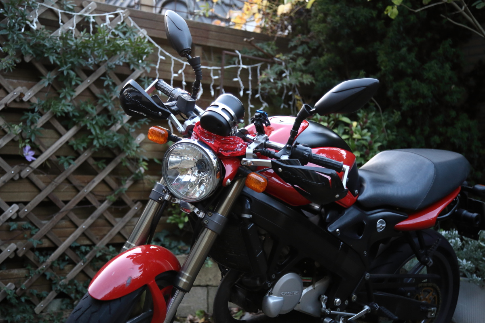](cagiva-raptor-125.jpg)

## Two-stroke bikes

Let's get one thing straight: I'm not a mechanic and will unlikely become one.  I'm not a racer and will unlikely become one, either. That doesn't prevent me from adoring state-of-the-art machines, namely the two-stroke race motorcycles.

Two-stroke engines are up to two times more powerful than equally-sized four-stroke engines (used in all cars and most motorcycles), but their power is only available at a narrow range of revolutions per minute. Their beauty comes in the form of powerful but smaller, lighter, and more agile motorcycles which are complex to drive. Two-strokes have a steep learning curve, but I didn't get into bikes to get from point A to point B in the most convenient manner, so I don't mind.

Here is a power graph of two-stroke and four-stroke motorcycles of the same engine size at different rotation speeds.

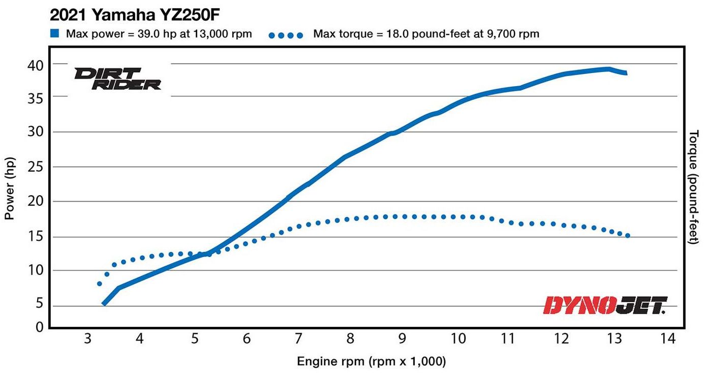

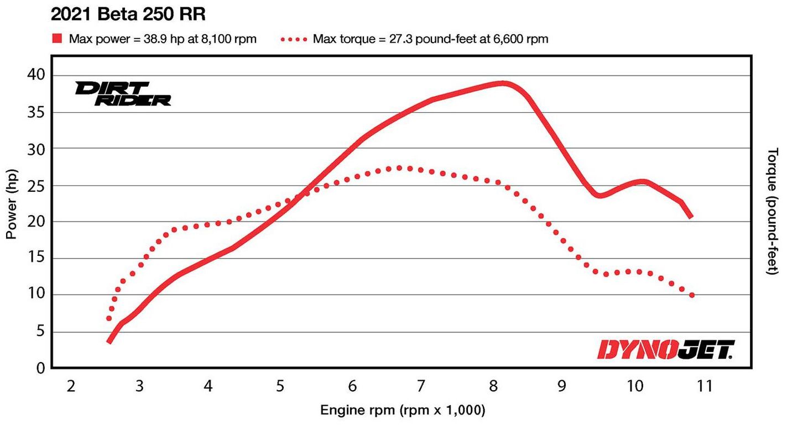

<!--more-->

You can see that the four-stroke has access to most of the engine power on top of the range, between 11.5k and 13k RPM. More gas equals more power there. The two-stroke gives access to its power between 7.2k and 8.7k RPM, i.e., overuse the gas, and you'll lose the speed. Also, there is less torque outside of that range, so getting to it is more complicated, and in practice, the rider has to maintain the correct engine speed at all costs to keep the pace.

Powerful two-strokes are a thing of the past because [EU regulations](https://www.transportpolicy.net/standard/eu-motorcycles-emissions/) made Euro 3 emissions standard mandatory for motorcycles approved for the market after July 2007, and two-strokes pollute the air significantly more.

In practice, if you want to drive one of such motorcycles outside the dirt track (where you can find the only modern two-strokes), the only option is to buy one made before ~2008 and do your best to maintain it.

That is why the graph's peak power of the two-stroke and four-stroke motorcycles is the same. 250cc bike from the pre-2007 era has a peak power of [62HP](https://www.cycleworld.com/250cc-two-stroke-sportbike-motorcycle-review-comparison-test/) ([derestricted](https://nsr-world.com/tuning/250-tuning/ignition/)), which is 59% more powerful than bikes above 

## Small race two-strokes

Because I like the idea of having a lightweight, powerful bike, I was searching for a 125-250cc two-stroke, whereas the common sense of riders around me (reasonably) hints towards 600-1200cc modern four-strokes.

The canonical choice in the category of 250cc is Suzuki RGV250, Honda NSR250, Yamaha TZR250, Aprilia RS250, and other similar race replicas, costing 8-12 thousand euros.

125cc bikes cost around 2.5-5 thousand euros, with Aprilia RS125 dominating the European market. However, the first model I heard of in that class was an unpopular Cagiva Raptor 125. The manufacturer Cagiva produced nothing after 2012 and is mainly forgotten outside Italy.

## What have I got, and what did I do with it

[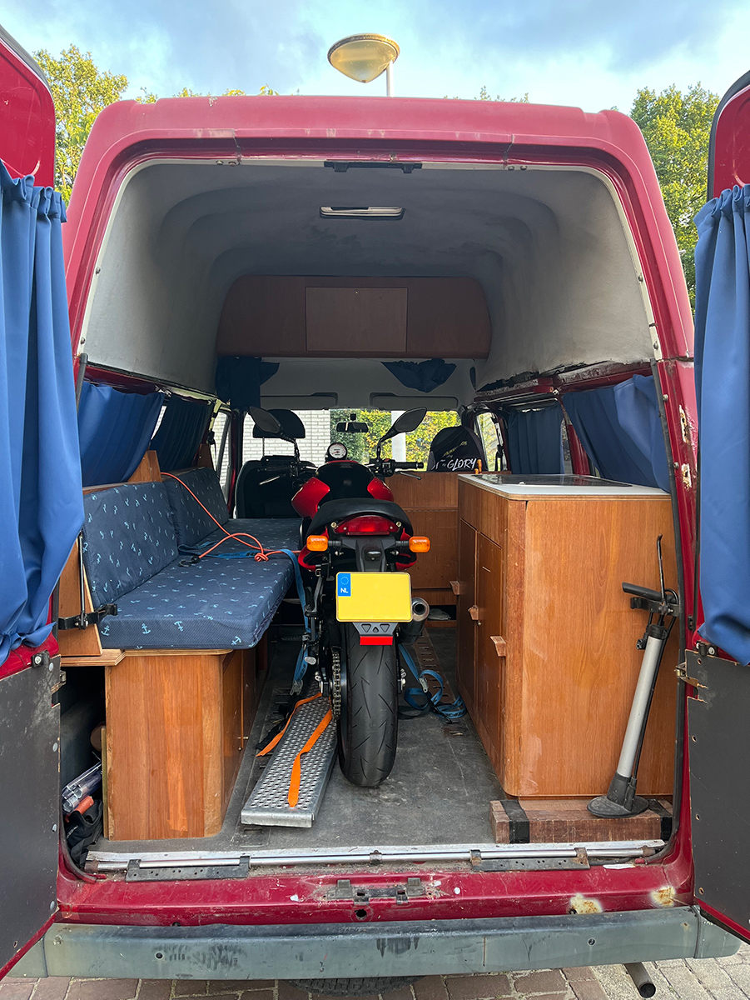](in-the-van.jpg)

[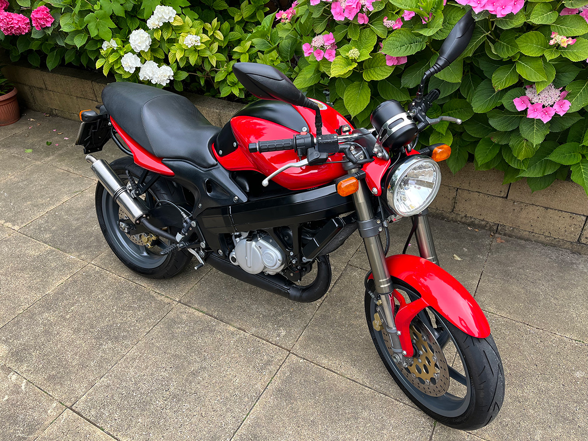](before-modification-1.jpg)

Right after hearing about Raptor 125, I found the one and only model selling in the Netherlands: it was produced in 2006 and imported there in 2016 as a first of its kind. I bought it already released from the original 15HP restriction, only to discover that the engine was busted.

[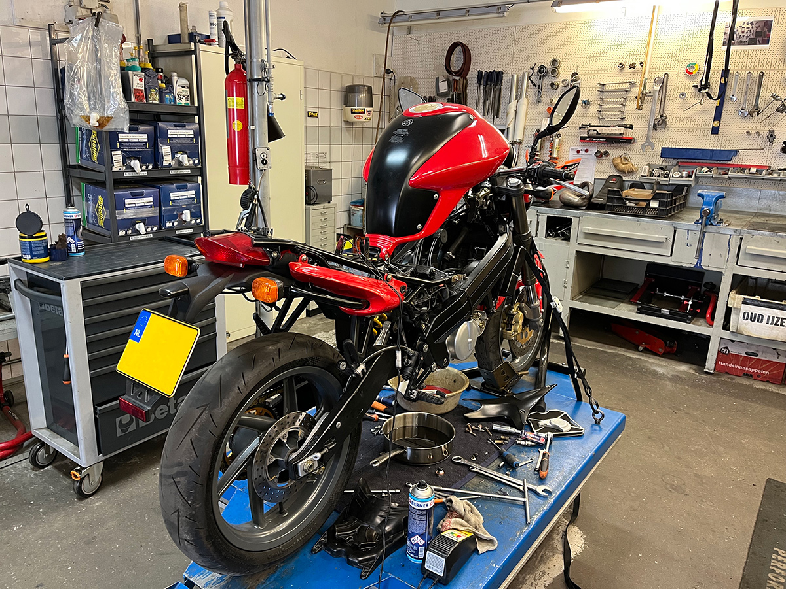](repairing.jpg)

[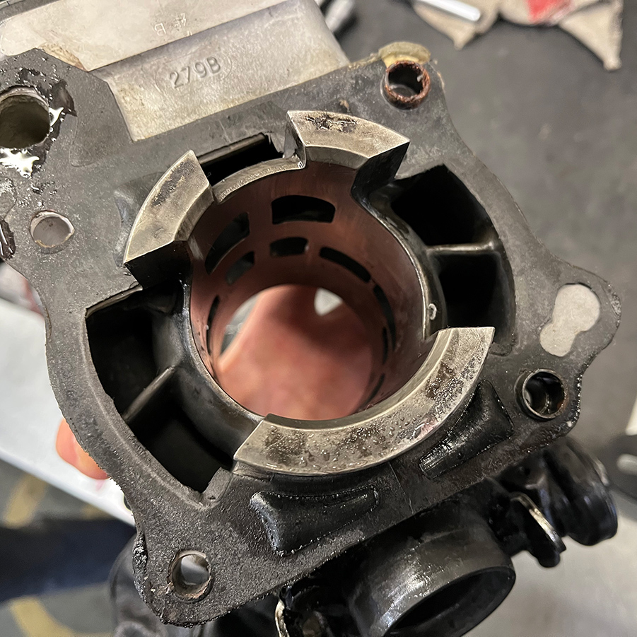](damaged-cylinder.jpg)

[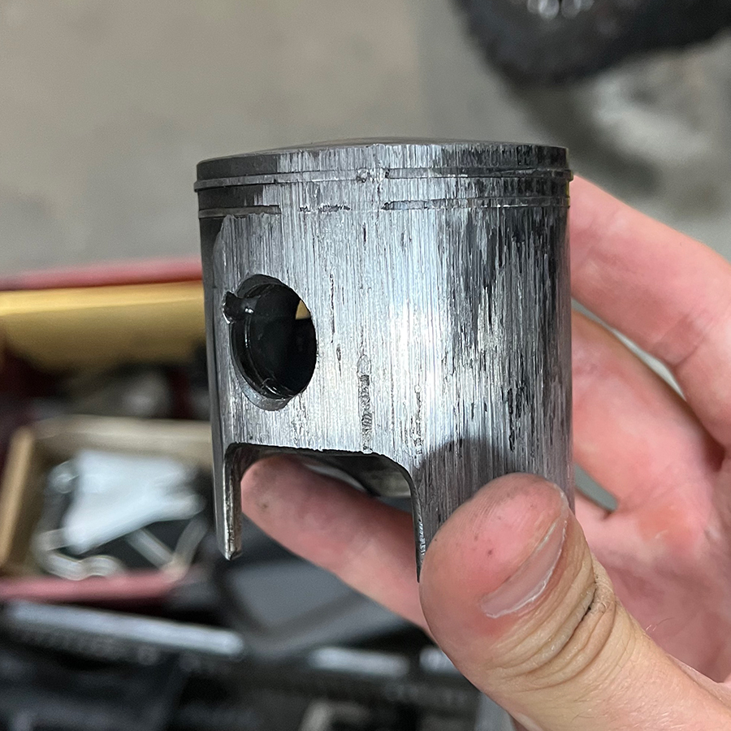](damaged-piston.jpg)

I knew something was wrong with the engine, not the carburettor, and the compression was low. Still, I didn't have the skills to tell what, so I brought the bike to the mechanic routinely maintaining modern two-stroke dirt motorcycles of Husqvarna and KTM, Peter from [Motorhuis de Doelen](https://www.motorhuisdedoelen.nl), whom I highly recommend now. The engine had a seizure, and he replaced the [piston, cylinder](https://www.pjme.co.uk/acatalog/Cagiva-Supercity-Cylinder-Kit-Dome-Top-Piston-2-Piston-Rings--1_2971.html) and [connection rod](https://www.pjme.co.uk/acatalog/Cagiva-Supercity-125-Race-Con-Rod-Kit--2_3367.html) (all available in stock on the UK site by the link) and [resealed](https://www.pjme.co.uk/acatalog/Cagiva-Raptor-125-Bearing-And-Seal-Kit-Koyo-2_3002.html) the crankshaft. Two months later, I got the bike back from his workshop with the engine running correctly.

As the plan is to use it for Moto Gymkhana, I couldn't afford to have a bike without crash bars or sliders. When I see experienced drivers like [Richard van Schouwenburg](https://www.youtube.com/c/RichardsMotoGymkhanaAdventures/videos?view=0&sort=p&flow=grid) or [Bert Schuld](https://www.youtube.com/channel/UCFGmj0IV8heS3FeY-6vd6QA/videos?view=0&sort=p&flow=grid) training, they often stop the attempts and go for a rest after dropping the bike more than once on tight turns.

[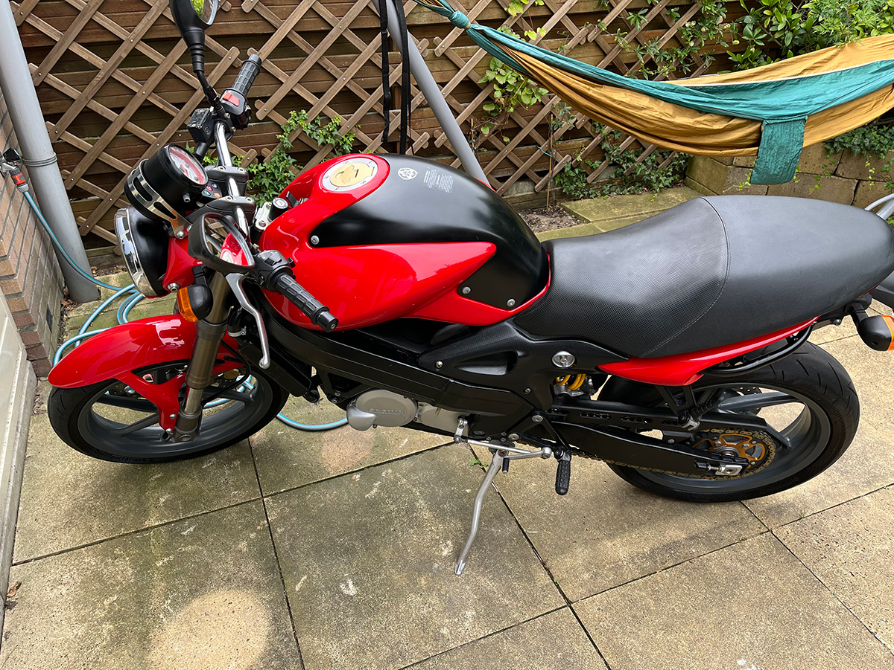](before-modification-2.jpg)
[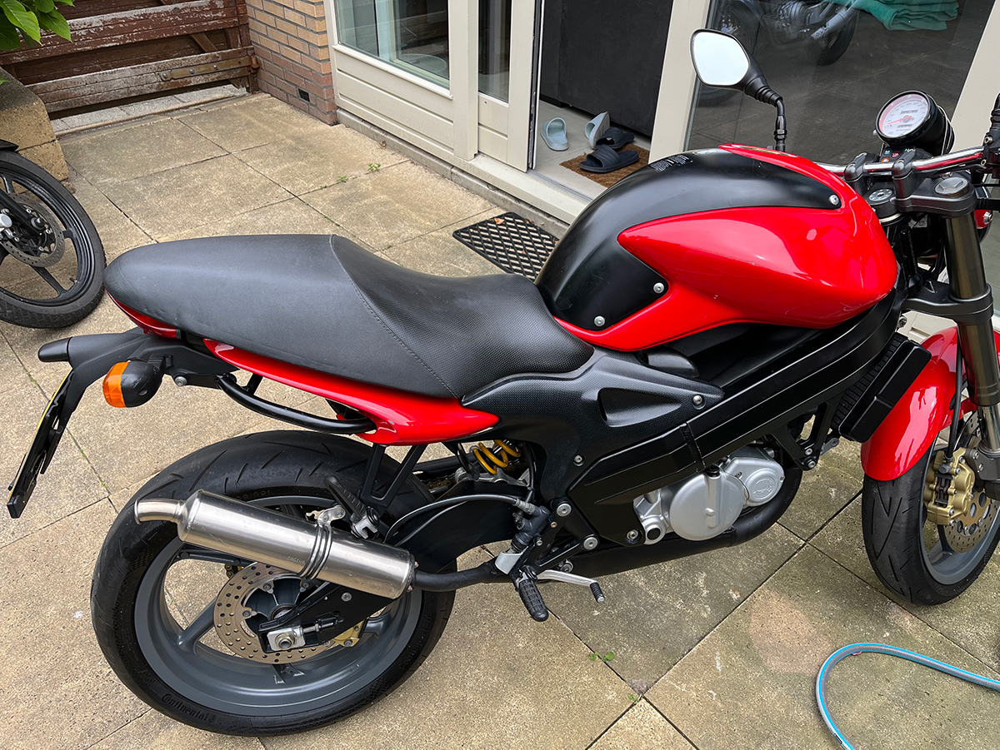](before-modification-3.jpg)

Another mechanic, Mike from [MVS Race Engineering](https://mvsracing.nl), specialising in customised motorcycle improvements, agreed to weld sliders for my bike to ensure the exhaust pipe wouldn't be the first thing touching the ground in tight turns. Below is a photo of the bike on the ground with installed sliders and aluminium handguards.

[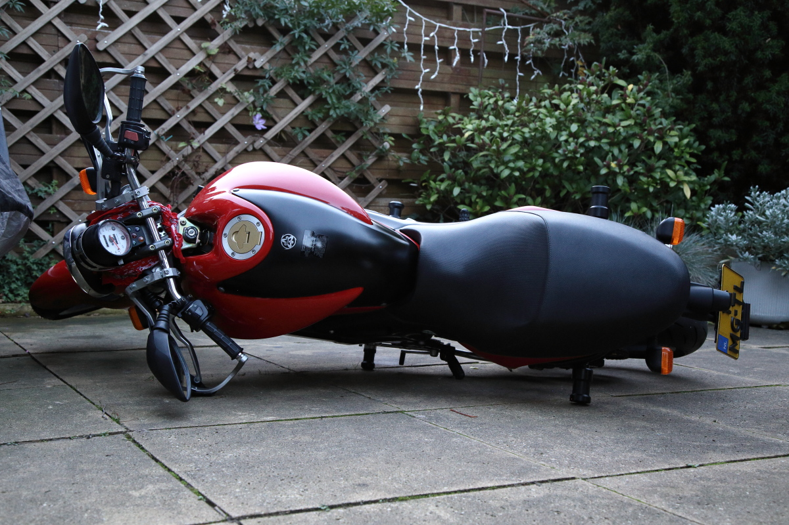](sliders.jpg)

It turned out he does a lot of other stuff, so I trusted him to tune the carburettor for optimal performance using his dynamometer test stand, which you can see below.

[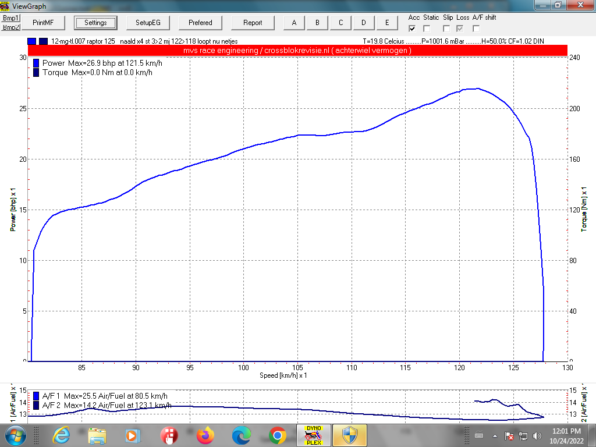](dynotest.png)

It was impossible to install the RPM reader on the ignition coil, so the test shows power over speed (directly proportional to RPM) on the fifth gear out of six. The bike turned out to have 27HP peak power, which is 80% more than the initially restricted 15HP.

And last, I've had to replace the Continental ContiSportAttack 2 tires installed back in 2016 with a set of modern Pirelli Diablo Rosso IV tires: Olaf from [MotoWoW](https://motowow.nl) did this in his trailer at my place within an hour, which was convenient.

[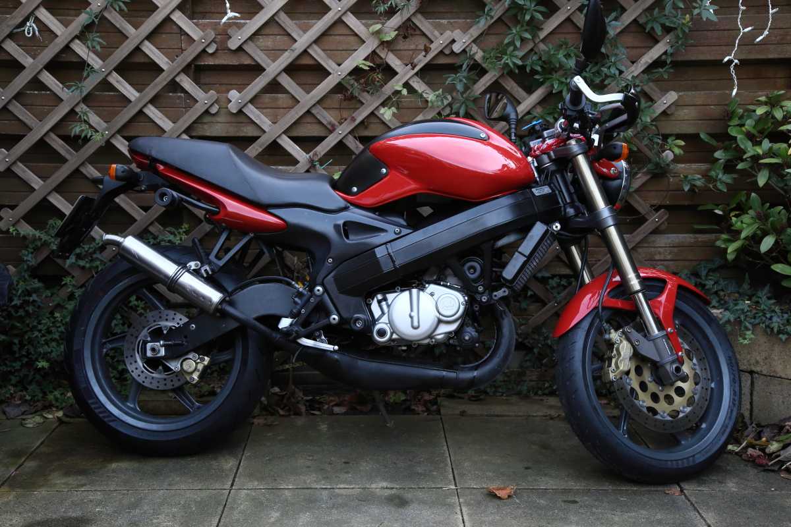](after-modification-1.jpg)

## The fun of riding the bike

The bike is insanely different from everything I rode before, despite trying a dozen other bikes on training courses. Small displacement Kawasaki Ninjas are probably as close as you can get to it. It gives a lot of feedback and is extremely powerful, but also agile and gives straightforward control by giving you direct access to brakes without ABS.

Even the smallest possible size race bike is still a race bike. Feeling the road surface and knowing how much more speed it's capable of delivering in a matter of seconds, it was genuinely scary to ride even at 100km/h, while it was not the case at 140km/h on 750cc Honda NC750X DCT I own. The last time I had that feeling was when I started [jumping](/tags/skydiving/) with my current small and fast Skylark's canopy Odyssey Evo 105.

The bike eats 6.6 litres of 98 gas per 100km and can go around 160km on a filled tank. Ethanol is bad for a carburettor, and because of that, I'm forced to use more expensive E5 (5% ethanol) 98 gas instead of cheaper E10 95, as a percentage of ethanol is regulated in the Netherlands. I would even need to dry the gas for winter storage and get more expensive Aspen 4 tact benzine into the system to keep the bike healthy. That's as far from the average commute motorcycle as you can get.

[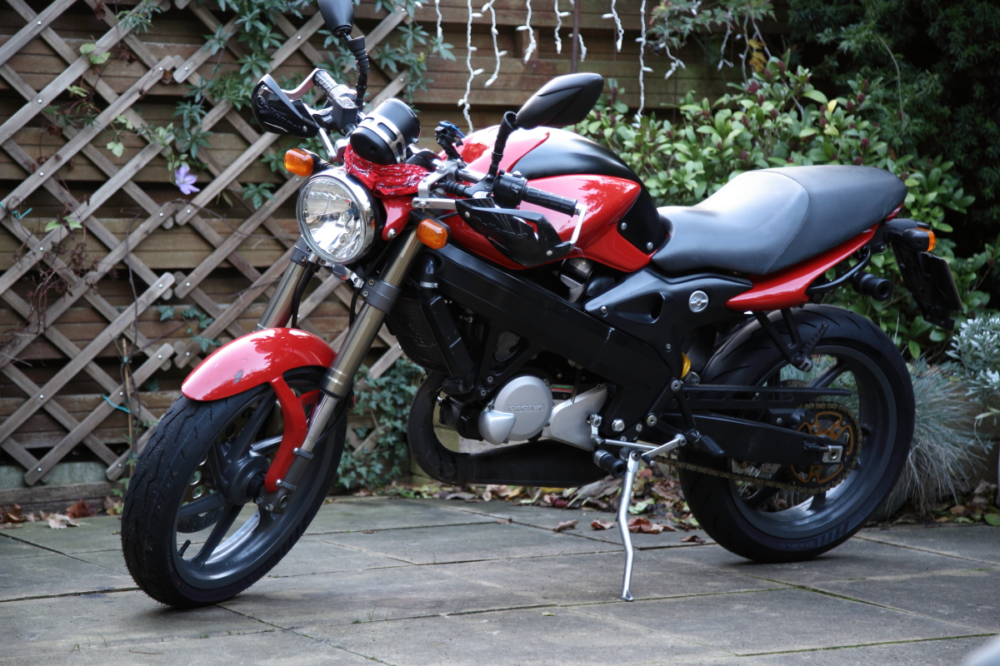](after-modification-2.jpg)

## Results

I got the bike on July 8 and gave it to the first mechanic the week after, got the engine problems sorted out on September 14, and the second mechanic finished the sliders and tuning on October 24. The initial acquisition price was 2450 euros, engine rebuilds around 1300 plus spare parts for 500, sliders and final tuning cost another 2000 for work and 350 for materials. Last and least, tires and their installation cost 500 euros.

After three and a half months of work, the total price is **6600** euros, which is 2.7 times more than the original price of the bike. Overall I expected lower costs, but the result is still within reasonable bounds. I am impressed that spending money on that provides some joy, even without considering the fun of riding the motorcycle.

[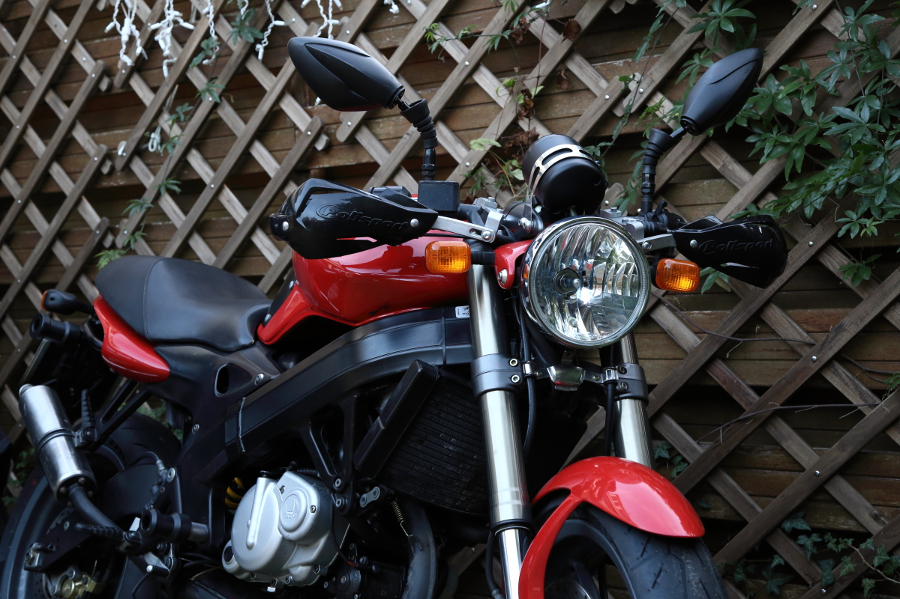](after-modification-3.jpg)

## Future work

After the first Motorcycle Gymkhana training, I found that the bike sprockets are optimised for maximum speed at a price of giving little to no torque. It's easy to go from 30 to 100 by shifting the gears up on the road, but it's  hard and slow to go from 0 to 30, which you do dozens of times on the Gymkhana track within a single run. The following steps for me are changing the sprockets to get torque at the cost of the top speed and changing the brake lines to armoured ones, primarily just for the cool look.

And last, I bought Motul RBF700 Racing Brake Fluid as similar brake fluids are used by the Gymkhana community worldwide. Still, after single training on the bike, I understood that I would rather keep the stock brake fluid as with the racing one, I'll burn the brakes themselves, and now I have the safety of brake fluid overheating before any permanent damage. The weakest link in the motorcycle for the next year or two is me, not the bike.

[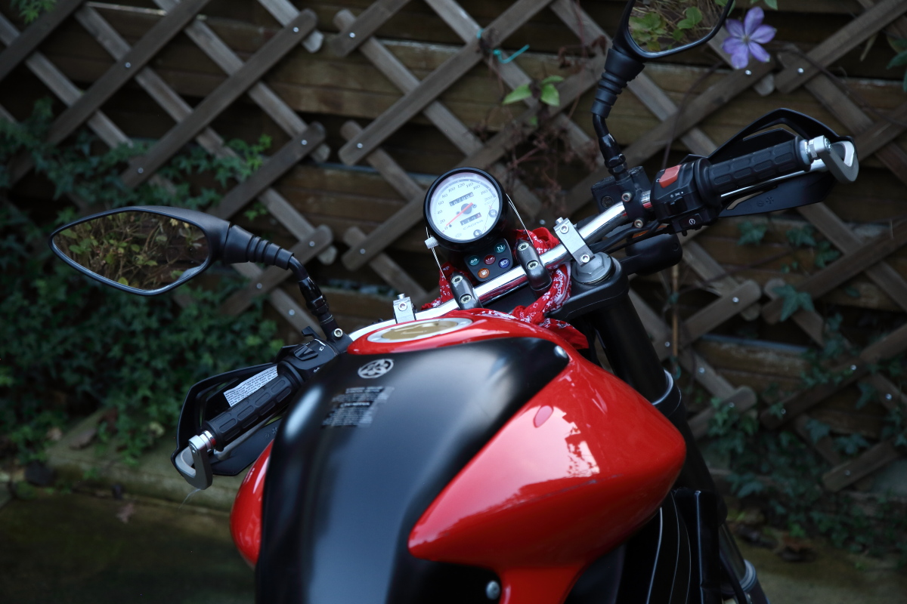](dashboard.jpg)
